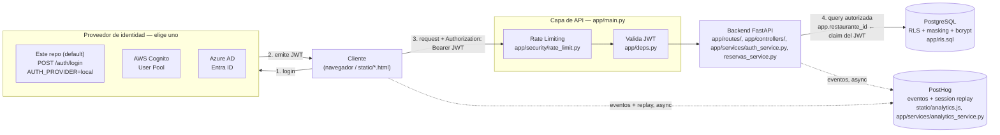

# Security architecture — deep dives

Supporting reference for [../GUIA-DE-PRUEBAS.md](../GUIA-DE-PRUEBAS.md). This file holds the material too long to inline in the topic-by-topic guide: the end-to-end diagram, the full TDD walkthrough, how to point this app at a real Cognito/Azure AD tenant, a real bug this repo's own RLS testing surfaced, the two bugs left in on purpose for the class exercise, and the Entrega 2 rubric mapping.

## Arquitectura de Seguridad End-to-End

Slide 24's diagram, redrawn for what this repo actually runs (`AUTH_PROVIDER=local` by default; swap the identity provider without touching anything downstream — that's the point of the diagram):



El cliente elige un proveedor de identidad; el resto de la cadena — rate limiting, validación de JWT, RLS, masking, encriptación de contraseñas — no cambia. `app/security/jwt.py`'s `decode_and_validate_token()` is the one function that branches on which box in "Proveedor de identidad" issued the token.

---

## TDD paso a paso

Running example: `enmascarar_telefono` in `app/security/masking.py`, tested by `tests/unit/test_masking.py`. The repo ships with the finished implementation (so the suite passes out of the box) — to actually feel the RED→GREEN→REFACTOR cycle, do this locally:

**1. RED — make the tests fail first.** Open `app/security/masking.py` and replace the body:

```python
def enmascarar_telefono(telefono: str) -> str:
    pass  # temporarily "unimplemented"
```

```bash
pytest tests/unit/test_masking.py -v
```

All 3 tests fail (`None != "*** *** 4567"`). That failure is the point — it proves the test actually exercises the code, and it's a precise, executable statement of what "done" looks like.

**2. GREEN — the smallest code that passes.** Implement just enough for the first test:

```python
def enmascarar_telefono(telefono: str) -> str:
    return "*** *** " + telefono[-4:]
```

Run the tests again — `test_masks_all_but_the_last_four_digits` now passes, but `test_short_phone_numbers_are_still_masked` and the boundary case still fail (a 3-digit input has no meaningful "last 4"). Extend until all 3 are green — that's the final version already in the repo.

**3. REFACTOR — clean up with the tests as a safety net.** With all 3 green, try simplifying (e.g., collapsing the two branches, renaming the parameter) and rerun `pytest tests/unit/test_masking.py -v` after every change. If you ever see red, you know immediately which edit broke behavior — that's the entire value proposition of TDD, and it's most visible on a function this small.

---

## Cognito y Azure AD: cómo conectar un tenant real

| Criterio | AWS Cognito | Azure AD (Entra ID) |
|---|---|---|
| Ecosistema natural | AWS | Microsoft 365 / Azure |
| Mejor para | Apps propias con usuarios finales (B2C) | Login corporativo / empresarial (B2B, SSO) |
| Estándar | OAuth 2.0 / OIDC | OAuth 2.0 / OIDC |
| Integración típica | API Gateway + Lambda | Apps empresariales, Microsoft Graph |
| Costo | Pago por usuario activo mensual (MAU) | Incluido en licencias Microsoft 365 / Azure AD |

This repo's `app/security/jwt.py` already implements the validation side for both (RS256 signature check against the provider's JWKS endpoint, plus `iss`/`aud` checks) — what it does *not* do, because it would require a cloud account this environment doesn't have, is provision a real User Pool or App Registration. To actually connect one:

**Cognito:**
1. Create a User Pool in the AWS Console (or `aws cognito-idp create-user-pool`), and an App Client.
2. Set in `.env`: `AUTH_PROVIDER=cognito`, `COGNITO_REGION`, `COGNITO_USER_POOL_ID`.
3. Point `static/login.html` at Cognito's Hosted UI instead of `POST /auth/login` (Hosted UI does the Authorization Code + PKCE dance for you and redirects back with tokens).
4. `app/deps.py` and every protected route work unchanged — `decode_and_validate_token()` now validates against Cognito's JWKS instead of the local HS256 secret.

**Azure AD / Entra ID:**
1. Register the app in Azure Portal ("App registrations" → New registration).
2. Set in `.env`: `AUTH_PROVIDER=azure`, `AZURE_TENANT_ID`, `AZURE_CLIENT_ID`.
3. Same idea: the frontend redirects to Microsoft's login page instead of calling `/auth/login`.

Either way, `restaurante_id` and `rol` — the two custom claims this app's RLS and AuthZ depend on — need to come from somewhere once you're not issuing the token yourself: as custom attributes on the Cognito User Pool, or as App Roles / custom claims in Azure AD, mapped in during token issuance.

---

## El superusuario invisible: un hallazgo real de este repo

Writing `tests/integration/test_reservas_crud.py::test_rls_blocks_cross_tenant_reads_even_with_no_where_clause_at_all` the first time, it **passed immediately** — which was suspicious, because the policy hadn't been tuned yet. The reason: `testcontainers.postgres.PostgresContainer`'s default connection role is the database's bootstrap user, and the official Postgres Docker image *always* makes that role a superuser. **Postgres unconditionally exempts superusers from every RLS policy** — the test was "passing" only because nothing was actually being filtered by anything, cross-tenant or not, and a bug in the policy itself would never have been caught.

The fix, now in `tests/integration/conftest.py` and `db/init/01-create-app-role.sql` (used by `docker-compose.yml`): create a **second, deliberately unprivileged role** (`reservas_app`, `NOSUPERUSER NOBYPASSRLS`) and have the application — and only the application — connect as that role. Even then, Postgres still doesn't apply RLS to a table's *owner* by default, so `app/rls.sql` also has `ALTER TABLE reservas FORCE ROW LEVEL SECURITY;` (needed because `reservas_app` owns the table it creates).

The other easy way to break this same policy silently: `current_setting('app.restaurante_id', true)` returns `NULL` if the GUC was *never* set in the session, but reverts to `''` (empty string, not `NULL`) once any transaction has done a `SET LOCAL app.restaurante_id` and then ended — casting `''::int` throws `invalid_text_representation`, not "no rows." The policy wraps it in `NULLIF(current_setting(...), '')::int` to treat both cases as "no restaurant set" → no rows, instead of a 500.

Lesson for the write-up: **an RLS test that never fails when you break the policy on purpose is not testing anything.** Verify this by commenting out `ALTER TABLE reservas FORCE ROW LEVEL SECURITY;` in `app/rls.sql`, re-running `python -m app.init_db` against a fresh database, and watching the cross-tenant test fail.

---

## Bugs intencionales: cómo se ven en cada herramienta

Two real bugs are left **unfixed on purpose** in this repo, specifically so a run of the full toolchain produces real error reports instead of an all-green suite — see [../GUIA-DE-PRUEBAS.md § Bugs intencionales](../GUIA-DE-PRUEBAS.md#bugs-intencionales-para-ver-los-reportes-de-las-librerías-en-acción) for the exact commands. This section is the "why" and "how it would be fixed" for each.

### Bug intencional #1 — race condition, `POST /auth/registro`

`app/services/auth_service.py`'s get-or-create for `Restaurante` checks "does it exist?" then, in a separate statement, `INSERT`s it if not — a classic TOCTOU (time-of-check to time-of-use) gap. Two concurrent requests for a brand-new restaurant name can both observe "doesn't exist yet" before either commits, and the second `INSERT` violates the `UNIQUE` constraint on `restaurantes.nombre` with an uncaught `IntegrityError`, which Starlette turns into a real `500`.

`loadtest/locustfile.py` is built specifically to reproduce this: every simulated user registers under the *same* restaurant name (`"carga-comun"`), maximizing contention, and calls `response.failure(...)` explicitly when `/auth/registro` doesn't return `201` — so Locust's own **Failures** report and end-of-run summary table show it in red.

The standard fix (not applied here, on purpose) is to catch the race's loser and re-read the row the winner just committed:

```python
restaurante = db.query(Restaurante).filter(Restaurante.nombre == payload.restaurante).first()
if restaurante is None:
    restaurante = Restaurante(nombre=payload.restaurante)
    db.add(restaurante)
    try:
        db.flush()
    except IntegrityError:
        db.rollback()
        restaurante = db.query(Restaurante).filter(Restaurante.nombre == payload.restaurante).first()
```

### Bug intencional #2 — `ZeroDivisionError`, `GET /reservas/resumen`

`app/services/reservas_service.py`'s `resumen_reservas()` computes `total_personas / len(reservas)` without guarding the empty-list case — true for every restaurant right after it registers, since it has zero reservations. That's a real, uncaught `ZeroDivisionError` → `500`.

`static/dashboard.html`'s `cargarResumen()` compounds it: it doesn't check `response.ok` before reading the body. Starlette's real `500` (no `DEBUG`) is plain text ("Internal Server Error"), not JSON — `await response.json()` throws an uncaught `SyntaxError` trying to parse it. The call site is fire-and-forget (no `await`), so it doesn't block the rest of the page, but the rejection is real and uncaught.

This single bug chain deliberately surfaces in three different tools' own reporting:

- **uvicorn/Starlette**: the raw Python traceback in the server's own logs, ending in `ZeroDivisionError: division by zero` — the most literal "see the library's report" of the three.
- **pytest**: `tests/integration/test_reservas_crud.py::test_resumen_of_a_restaurante_with_no_reservas_hits_bug_intencional_2` documents it with `pytest.raises(ZeroDivisionError)` (FastAPI's `TestClient` re-raises unhandled server exceptions instead of turning them into a response, by default) — remove the `pytest.raises` and pytest's failure report shows the same traceback.
- **Playwright + PostHog**: `tests/e2e/test_reportes_de_errores.py` listens on `page.on("pageerror", ...)` — Playwright surfaces uncaught page errors without any extra instrumentation — and, when `POSTHOG_PROJECT_API_KEY` is set, the same error is captured by PostHog's exception autocapture (`static/analytics.js`, `capture_exceptions: true`) as a `$exception` event, with a full session replay of the moment it happened.

The fix (not applied here, on purpose) is a one-line guard:

```python
promedio = total_personas / len(reservas) if reservas else 0.0
```

---

## Rúbrica de Entrega 2 — dónde está la evidencia

Direct mapping of slide 25's rubric to files in this repo:

| Entregable de la rúbrica | Qué debes evidenciar | Dónde está aquí |
|---|---|---|
| Tests unitarios y de integración | Suite ejecutable, lógica de negocio + al menos una prueba de integración real | `tests/unit/` (17 tests) + `tests/integration/` (18 tests, Postgres real vía Testcontainers) |
| PoC funcional (40%) | Login/registro funcionando, backend valida el JWT en cada request protegida | `app/routes/auth_routes.py`, `app/controllers/auth_controller.py`, `app/deps.py`; demo con `static/login.html` |
| Calidad del código (20%) | AuthN + validación de tokens, sin credenciales hardcodeadas ni secretos en el repo | `app/config.py` (todo viene de env), `.env.example` (sin secretos reales), `.gitignore` |
| Justificación / sustentación (25%) | Por qué eligieron su proveedor de identidad, cómo protegen datos sensibles | Esta sección + "Cognito y Azure AD" arriba + `app/rls.sql` (RLS/masking) + `app/security/passwords.py` (hashing) |
| Sustentación individual (15%) | Cada integrante explica una prueba o mecanismo de seguridad con criterio propio | Usa [../GUIA-DE-PRUEBAS.md](../GUIA-DE-PRUEBAS.md) como guion — está organizada exactamente por tema para repartir |

La actividad de la slide 26 (login con Cognito/Azure AD + generar/validar JWT + al menos una prueba unitaria y una de integración de ese flujo) está resuelta con el proveedor local por defecto — ver la sección "23. Actividad" de la guía para el mapeo exacto a los archivos de test.
