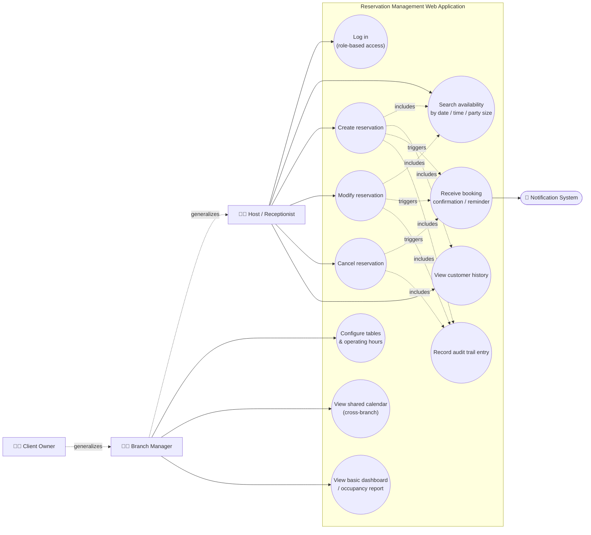

# Diagrama de casos de uso — Reservation Management Web Application

**Reference:** RFP-001, scope frozen in [SOW.md](../SOW.md)

## Actors

Derived from the [Roles](../SOW.md#roles) table in the SOW:

| Actor | Source |
|---|---|
| Host/Receptionist | Primary daily user — booking, modification, cancellation |
| Branch Manager | Branch configuration, cross-branch calendar, dashboard |
| Client Owner | Multi-branch oversight, does not do daily booking work |
| Notification System *(secondary actor)* | Sends confirmation/reminder emails (issue [#15](https://github.com/ngonza27/trayectoria_dllo_software/issues/15)) |

`Branch Manager` and `Client Owner` inherit every use case available to `Host/Receptionist`, plus their own management-only use cases — modeled below with `<<extends>>`-style generalization arrows.

## Diagram

## Use case summary

| Use case | Actor(s) | Traces to |
|---|---|---|
| Log in (role-based access) | Host, Manager, Owner | Issue [#11](https://github.com/ngonza27/trayectoria_dllo_software/issues/11) |
| Search availability | Host, Manager | Issue [#12](https://github.com/ngonza27/trayectoria_dllo_software/issues/12) |
| Create reservation | Host, Manager | Issue [#12](https://github.com/ngonza27/trayectoria_dllo_software/issues/12) |
| Modify reservation | Host, Manager | Issue [#13](https://github.com/ngonza27/trayectoria_dllo_software/issues/13) |
| Cancel reservation | Host, Manager | Issue [#13](https://github.com/ngonza27/trayectoria_dllo_software/issues/13) |
| View customer history | Host, Manager | Issue [#24](https://github.com/ngonza27/trayectoria_dllo_software/issues/24) |
| Configure tables & operating hours | Manager | Issue [#14](https://github.com/ngonza27/trayectoria_dllo_software/issues/14) |
| View shared calendar (cross-branch) | Manager, Owner | Issue [#23](https://github.com/ngonza27/trayectoria_dllo_software/issues/23) |
| View basic dashboard / occupancy report | Manager, Owner | Issue [#16](https://github.com/ngonza27/trayectoria_dllo_software/issues/16) |
| Receive booking confirmation / reminder | Notification System | Issue [#15](https://github.com/ngonza27/trayectoria_dllo_software/issues/15) — email-only, SMS out of scope |
| Record audit trail entry | *(system-triggered, no direct actor)* | Issue [#20](https://github.com/ngonza27/trayectoria_dllo_software/issues/20) |

Out of scope per the SOW's [Scope](../SOW.md#scope) section, and therefore excluded from this diagram: food ordering, loyalty programs, payment/deposit collection, and SMS reminders.
