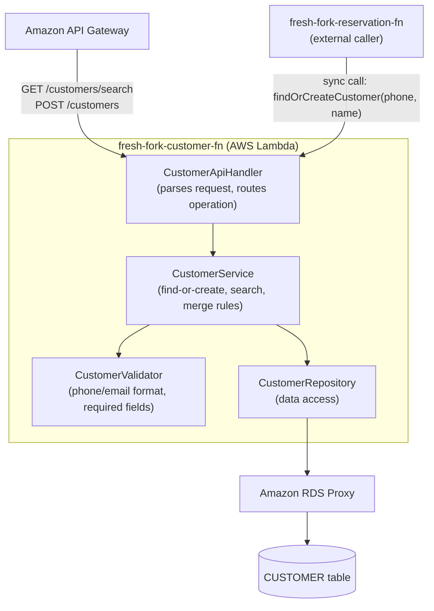

# Diagrama de componentes (nivel bajo) — Customer Service

**Reference:** RFP-001, scope frozen in [SOW.md](../SOW.md). Drill-down of the `fresh-fork-customer-fn` box in the [system component diagram](./componentes.md) and the AWS [architecture diagram](./arquitectura-aws.md).

This is an example of how a single bounded context from the system-level diagram breaks down internally. It follows the same handler → service → validator → repository layering that every other Lambda-backed service in this project should use, so it doubles as the template for detailing the remaining services later.

## Diagram

## Component responsibilities

| Component | Responsibility | Traces to |
|---|---|---|
| CustomerApiHandler | Entry point for both API Gateway requests (staff searching customer history) and direct invocations from `fresh-fork-reservation-fn` during booking | Issue [#24](https://github.com/ngonza27/trayectoria_dllo_software/issues/24) |
| CustomerService | `findOrCreateCustomer(phone, name)` — returns the existing customer if the phone number matches, otherwise creates one; `searchByNameOrPhone(query)` for the receptionist history lookup | Issue [#24](https://github.com/ngonza27/trayectoria_dllo_software/issues/24), backlog [RES-007](../scoping/backlog_scope.md) |
| CustomerValidator | Rejects a customer record without a usable phone number or with a malformed email before it reaches the database | Issue [#24](https://github.com/ngonza27/trayectoria_dllo_software/issues/24) |
| CustomerRepository | Only component that talks to the `CUSTOMER` table (via RDS Proxy); keeps SQL out of the service layer | [modelo-datos.md](./modelo-datos.md#entity-relationship-diagram) |

`findOrCreateCustomer` uses the phone number as the de-duplication key — this is a placeholder rule until the "merge duplicate phone numbers" item in [mvp_scope.md](../scoping/mvp_scope.md) is resolved with the client, and it is kept in the service layer (not the repository) so it can change without touching SQL.
