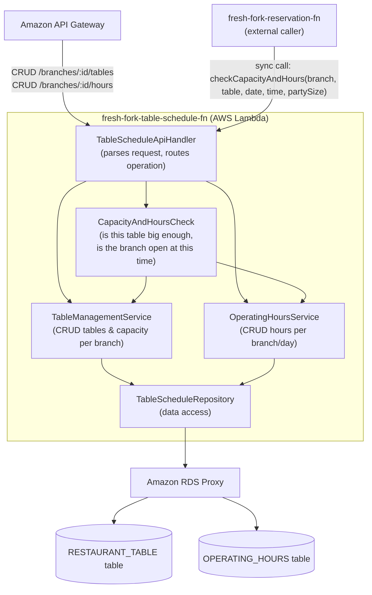

# Diagrama de componentes (nivel bajo) — Table & Schedule Service

**Reference:** RFP-001, scope frozen in [SOW.md](../SOW.md). Drill-down of the `fresh-fork-table-schedule-fn` box in the [system component diagram](./componentes.md) and the AWS [architecture diagram](./arquitectura-aws.md).

Same handler → service → repository layering as [componentes-customer-service.md](./componentes-customer-service.md). This service owns per-branch table inventory and operating hours; it does **not** own the reservation-overlap check — that stays inside `fresh-fork-reservation-fn`, which is the only writer of the `RESERVATION` table (see [componentes.md](./componentes.md#component-responsibilities)). This service answers "what tables exist and when is the branch open," and the Reservation service combines that answer with its own overlap check.

## Diagram

## Component responsibilities

| Component | Responsibility | Traces to |
|---|---|---|
| TableScheduleApiHandler | Entry point for manager-facing CRUD requests and for the synchronous check `fresh-fork-reservation-fn` makes before writing a reservation | Issue [#14](https://github.com/ngonza27/trayectoria_dllo_software/issues/14) |
| TableManagementService | Create/update/deactivate tables and their seat capacity, scoped to one branch | Issue [#14](https://github.com/ngonza27/trayectoria_dllo_software/issues/14) |
| OperatingHoursService | Create/update the open/close time per branch and day of week | Issue [#14](https://github.com/ngonza27/trayectoria_dllo_software/issues/14) |
| CapacityAndHoursCheck | Answers "does table X seat `party_size`?" and "is branch Y open at this date/time?" — the two checks `fresh-fork-reservation-fn` needs before it attempts to insert a reservation | Issue [#12](https://github.com/ngonza27/trayectoria_dllo_software/issues/12) (supports, does not replace, the DB-level overlap check) |
| TableScheduleRepository | Only component that talks to `RESTAURANT_TABLE` and `OPERATING_HOURS` (via RDS Proxy) | [modelo-datos.md](./modelo-datos.md#entity-relationship-diagram) |

The actual double-booking guard — the `EXCLUDE` constraint on `RESERVATION` — lives with the reservation writer, not here; see [modelo-datos.md](./modelo-datos.md#key-constraints-not-visible-in-the-diagram-notation). Keeping that constraint on the table this service does **not** own is intentional: it means the overlap check can never be bypassed by calling this service directly.
