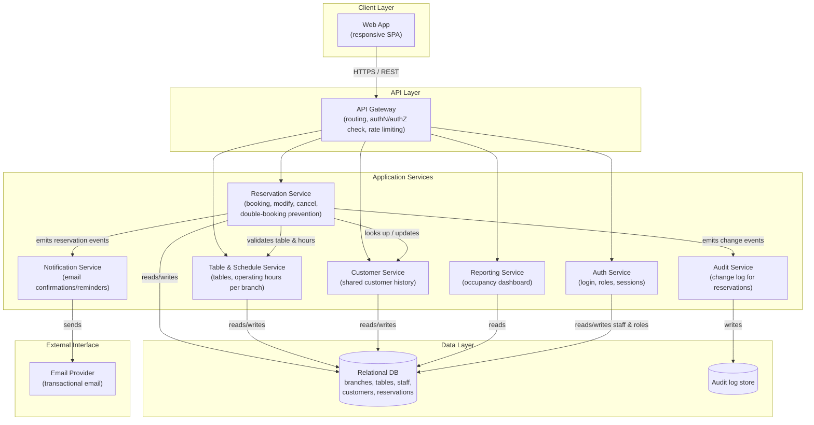

# Diagrama de componentes — Reservation Management Web Application

**Reference:** RFP-001, scope frozen in [SOW.md](../SOW.md)

This diagram shows the internal building blocks of the application at the software-component level (independent of the AWS deployment — see [arquitectura-aws.md](./arquitectura-aws.md) for that mapping). Each backend component corresponds to one bounded context, sized so a single small contractor team (see [Who does what](../SOW.md#who-does-what)) can build and operate it.

## Diagram

## Component responsibilities

| Component | Responsibility | Traces to |
|---|---|---|
| Web App | Renders booking, calendar, and dashboard UI; works on common browsers with no install | Issue [#25](https://github.com/ngonza27/trayectoria_dllo_software/issues/25) |
| API Gateway | Single entry point; enforces authentication and role checks before forwarding requests | Issue [#11](https://github.com/ngonza27/trayectoria_dllo_software/issues/11) |
| Auth Service | Staff login, password/session management, role-based access (host vs. manager) | Issue [#11](https://github.com/ngonza27/trayectoria_dllo_software/issues/11) |
| Reservation Service | Core booking logic; enforces double-booking prevention at the data layer | Issue [#12](https://github.com/ngonza27/trayectoria_dllo_software/issues/12), [#13](https://github.com/ngonza27/trayectoria_dllo_software/issues/13) |
| Table & Schedule Service | Per-branch table inventory and operating hours configuration | Issue [#14](https://github.com/ngonza27/trayectoria_dllo_software/issues/14) |
| Customer Service | Shared customer records/history across the three branches | Issue [#24](https://github.com/ngonza27/trayectoria_dllo_software/issues/24) |
| Notification Service | Sends email confirmations and reminders; decoupled from the booking transaction | Issue [#15](https://github.com/ngonza27/trayectoria_dllo_software/issues/15) |
| Reporting Service | Basic occupancy dashboard for managers | Issue [#16](https://github.com/ngonza27/trayectoria_dllo_software/issues/16) |
| Audit Service | Records who changed what reservation and when | Issue [#20](https://github.com/ngonza27/trayectoria_dllo_software/issues/20) |

The Reservation Service is deliberately kept as the single writer of reservation state — Table & Schedule and Customer are read dependencies it calls synchronously, while Notification and Audit are downstream consumers it notifies asynchronously, so a slow email provider can never block or fail a booking.
