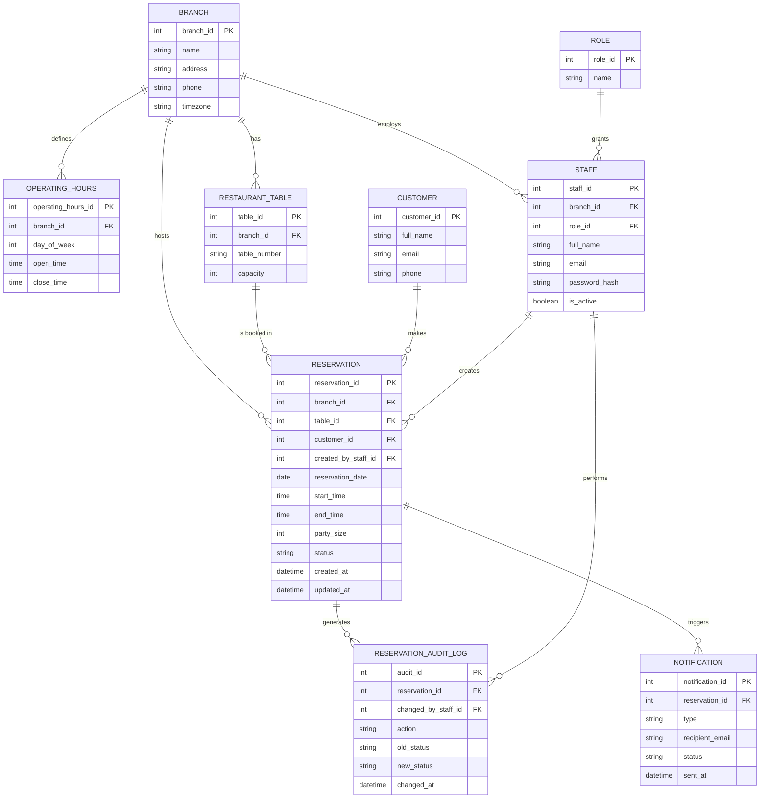

# Modelo de datos (ER) — Reservation Management Web Application

**Reference:** RFP-001, scope frozen in [SOW.md](../SOW.md)

This is the relational data model behind the `Amazon RDS for PostgreSQL` store in the [AWS architecture](./arquitectura-aws.md). Every entity maps to a requirement already committed in the SOW: branches/tables/hours (issue [#14](https://github.com/ngonza27/trayectoria_dllo_software/issues/14)), reservations with DB-level double-booking prevention (issue [#12](https://github.com/ngonza27/trayectoria_dllo_software/issues/12)), staff roles (issue [#11](https://github.com/ngonza27/trayectoria_dllo_software/issues/11)), shared customer history (issue [#24](https://github.com/ngonza27/trayectoria_dllo_software/issues/24)), and the audit trail (issue [#20](https://github.com/ngonza27/trayectoria_dllo_software/issues/20)).

## Entity-relationship diagram

## Key constraints not visible in the diagram notation

- `UNIQUE (branch_id, day_of_week)` on `OPERATING_HOURS` — one schedule row per branch per weekday.
- `UNIQUE (branch_id, table_number)` on `RESTAURANT_TABLE` — table numbers are only unique within a branch.
- `UNIQUE (email)` on `STAFF` — one login per person.
- `EXCLUDE` constraint (PostgreSQL `EXCLUDE USING gist`) on `RESERVATION (table_id, tsrange(reservation_date + start_time, reservation_date + end_time))` — this is the actual double-booking prevention mechanism required by issue [#12](https://github.com/ngonza27/trayectoria_dllo_software/issues/12); it rejects overlapping reservations for the same table at the database level, not just in application code.

## Normalization walkthrough

**1NF — atomic values, no repeating groups.** Every attribute above holds a single scalar value (no comma-separated table lists, no arrays of time slots). `OPERATING_HOURS` is split into one row per `(branch, day_of_week)` instead of one `BRANCH` row with seven open/close columns — that would have violated 1NF by encoding a repeating group as columns.

**2NF — no partial dependency on part of a composite key.** Every table here uses a single-column surrogate primary key (`*_id`), so there is no composite key to have a partial dependency on — 2NF is satisfied automatically. The only place a composite natural key was tempting was `RESTAURANT_TABLE` (`branch_id + table_number`); it was kept as a `UNIQUE` constraint over a surrogate `table_id` instead, precisely so no other table has to carry a two-column foreign key just to reference "table 5 at branch 2."

**3NF — no transitive dependency on a non-key attribute.** This is the constraint that shaped the split into 9 tables instead of a wide `RESERVATION` table:
- `Customer` name/email/phone are **not** stored on `RESERVATION` — they live in `CUSTOMER` and are pulled in via `customer_id`. Storing them on the reservation would make `full_name`/`email` transitively dependent on `customer_id`, which is not the reservation's key, and would duplicate/desync customer data across every booking (exactly the shared-history bug the SOW's [#24](https://github.com/ngonza27/trayectoria_dllo_software/issues/24) is meant to fix).
- `Branch` name/address/timezone are **not** repeated on `STAFF`, `RESTAURANT_TABLE`, or `RESERVATION` — each carries only `branch_id`.
- `Role` name is **not** repeated on `STAFF` — `STAFF` carries `role_id`, and role attributes live once in `ROLE`.
- The audit trail is its own table (`RESERVATION_AUDIT_LOG`) rather than `old_status`/`new_status` columns bolted onto `RESERVATION`, because a reservation has *many* status changes over time, not one — collapsing them onto the reservation row would reintroduce a repeating group (back to a 1NF violation) as well as a transitive/historical dependency problem.

**BCNF — every determinant is a candidate key.** Checking each table's functional dependencies: in every table above, the only attribute(s) that determine every other column are the primary key (or a declared alternate key, e.g. `email` in `STAFF`, `(branch_id, day_of_week)` in `OPERATING_HOURS`). There is no non-key attribute that determines another non-key attribute — e.g. `party_size` does not determine `status`, `table_number` does not determine `capacity` independent of `table_id` — so no table has the anomaly BCNF is designed to catch (a determinant that isn't a candidate key). The model is therefore in BCNF, which for this schema coincides with 3NF since no table has overlapping composite candidate keys.
